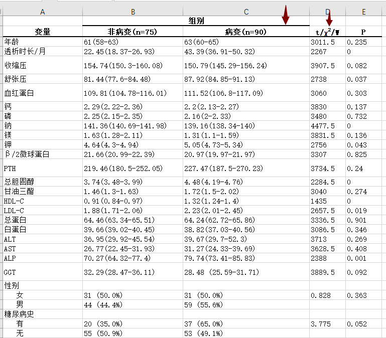
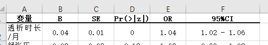

# 说明

这也是我进校初次读“生信”水文的时候迷惑的东西，什么时候该用单因素，什么时候该用多因素？是不是单因素显著就能纳入多因素？？？后来我明白，很多“生信”水文其实并称不上生信，只是套皮的公卫或者临床文章。这里要做的就是比较典型的临床数据：数据很“脏”，结果很差。但是这就是数据处理、分析的实际状况。
第一次提示稍微写多一点。

# 要求：

## 清洗、整理数据

缺失值要插补（注意缺失类型，是离散缺失还是连续缺失）。一些需要用数值表示而不是字符的要转数值。该转因子的要转因子。冗杂的列要删除

## 以组织未病变为对照，对各个变量进行单因素分析

单因素分析就是看单个变量在不同组别的分布差异。这里需要注意的是各个检验的使用条件，小样本量能用t检验就用t检验，如果不满足t检验的使用条件，再用非参数的方法，卡方检验同理。需要给出每一组别的均数和均数的95%置信区间（非参数检验没有固定分布类型，想想该用什么估算置信区间）、统计量和显著性，分类变量需要给出相对数。类似下表：

标箭头的，比如说黑线、卡方符号是我手动加的。输出的表中不需有，卡方符号可以用chi-sq代替。输出的表要求输出成去掉黑线和卡方符号的样子。

## 多因素分析

多因素分析就是多个变量水平上的分析，但是由于变量间有相互作用，所以单因素显著的多因素未必显著。

这里要求纳入单因素中显著的因素，考虑到变量间的共线性，建立多元logistic回归模型，不需要评估模型，建立就行了。给出常用的统计量即可，如下表：

# 进阶要求：

完成所有红字的要求，如果完不成也可以拿到基础分，因为这是第一次。

# 数据

[下载链接](https://pan.baidu.com/s/1ibUHpGeh2Yngv67KRwePTw?pwd=9uql)，最后也在这个文件夹中给我哦。

最后也在这个文件夹里给我哦。如果你用的是python，就用pycharm新创个pyProject。
